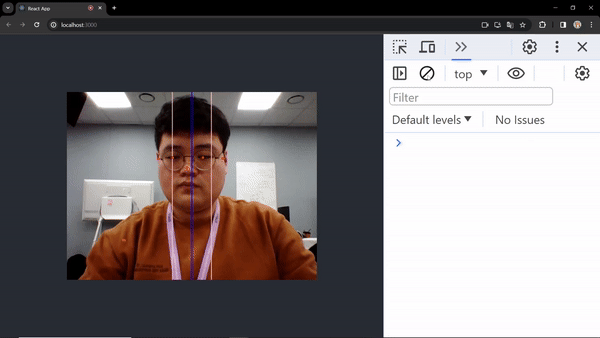
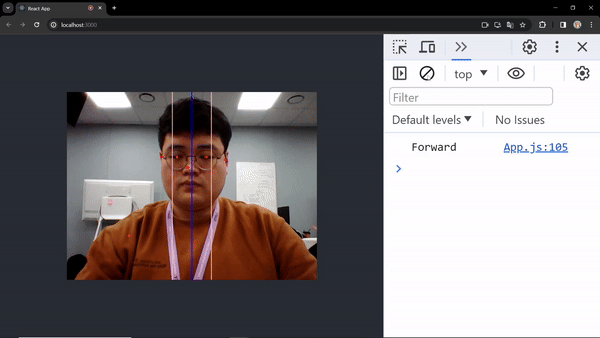

# TensorFlow

## Posenet : 자세 인식(Pose detection)
- https://github.com/tensorflow/tfjs-models/tree/master/pose-detection
```
npm install @tensorflow/tfjs @tensorflow-models/posenet react-webcam
```

### 예시
<details>
<summary>화면 기준으로 얼굴(코) 위치 확인</summary>

|좌측|정면|우측|
|:---:|:---:|:---:|
||||

</details>

## Facemesh : 얼굴 랜드마크 감지(Face landmark detection)
- https://github.com/tensorflow/tfjs-models/tree/master/face-landmarks-detection
```
npm install @tensorflow/tfjs @tensorflow-models/facemesh react-webcam
```

### 수정 사항
- 240111(facemesh 추가)
    - 점이 너무 많아 쓰기엔 힘들듯
- 240112(posenet 기능 추가)
    - 웹캠 화면 좌우 대칭
    - 대칭에 따른 점 다시 찍음(빨간색)
    - 새로운 진행 방향 기준(화면 위치 기준, 코 위치)
        - 기존 코드는 주석 처리(양 어깨 가운데 기준, 코눈귀 위치)
- 240125
    - 활용 예시 사진(움짤) 추가
    

    